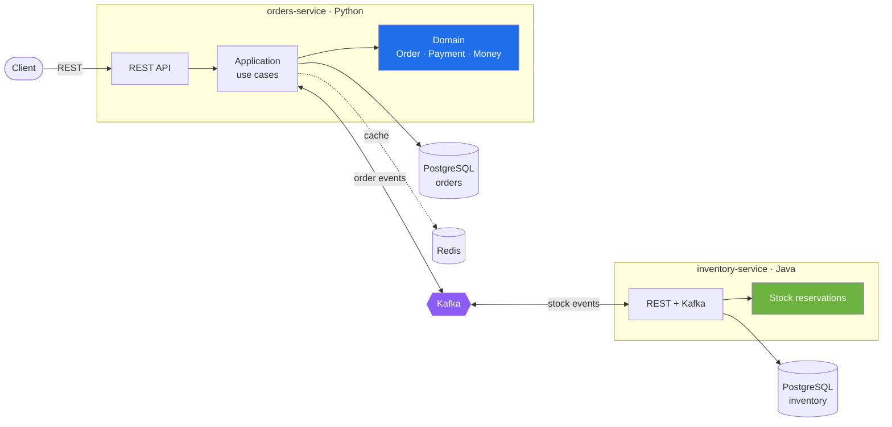
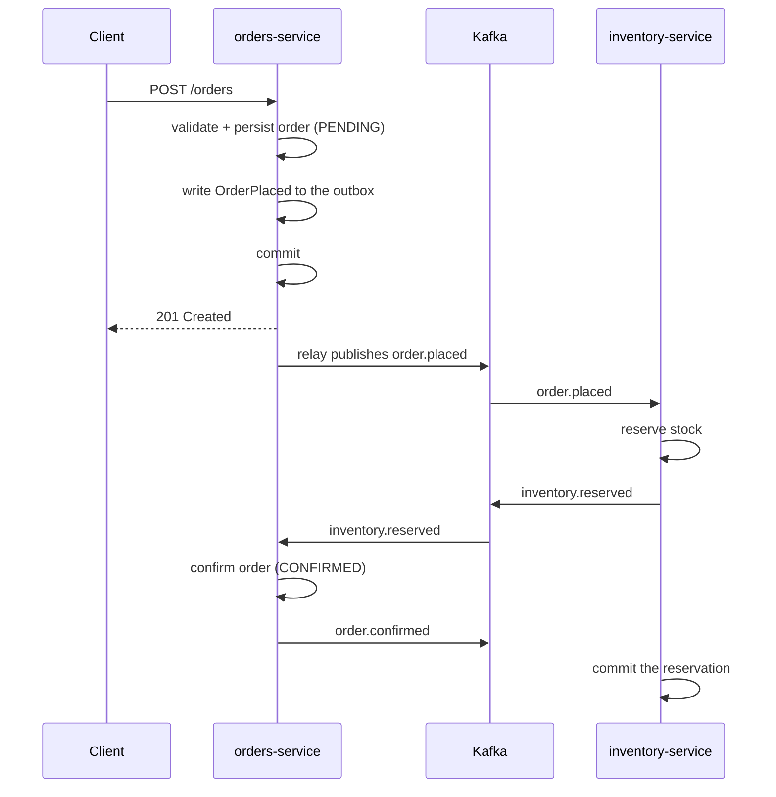

# Commerce Platform

Order management for an online store. Handles the order lifecycle from
checkout to shipment, coordinates stock reservation with the inventory
service, and guarantees that state changes and published events stay
consistent.

[](https://github.com/jorgecbr/commerce-platform/actions/workflows/ci.yml)
[](https://www.python.org/)
[](https://fastapi.tiangolo.com/)
[](https://openjdk.org/)
[](https://spring.io/projects/spring-boot)
[](LICENSE)

## Services

| Service | Stack | Responsibility |
|---|---|---|
| `orders-service` | Python 3.12 · FastAPI | Order lifecycle, pricing, payments |
| `inventory-service` | Java 21 · Spring Boot | Stock levels, reservations |

Each service owns its database. They never read each other's tables.

## Architecture



### Inside `orders-service`

Three layers with the dependency rule pointing inwards:

```
app/
├── domain/         entities, value objects, invariants. Imports nothing.
├── application/    use cases and the ports they depend on
└── adapters/       http, db, cache, events
```

`domain/` imports nothing from the rest of the codebase — no ORM, no web
framework, no broker client. Business rules are therefore testable in
isolation and portable to another runtime without rewriting them.

## How an order flows



If stock is unavailable the inventory service emits `inventory.rejected` and
the order is cancelled instead, with the reservation released. The order
service owns the decision, so the flow is a saga orchestrated from one place
rather than spread across both services.

### Why the outbox

The order is written to PostgreSQL and the event is written to the **same
transaction**. A separate relay then publishes to Kafka. Publishing to the
broker first and committing to the database afterwards would allow an event
for an order that was never stored; the reverse order can lose the event but
the relay recovers it. See
[`app/adapters/db/outbox.py`](orders-service/app/adapters/db/outbox.py).

## Development

```shell
make up       # start PostgreSQL, Redis and Kafka
make run      # orders-service on :8000
make test     # full suite
make check    # lint + types + dependencies + tests
```

## Testing

```shell
cd orders-service
uv sync
uv run pytest
```

Unit tests cover the domain and the use cases with in-memory fakes and need
no running infrastructure. Integration tests run against containers.

## Documentation

- [`docs/architecture/c4-context.md`](docs/architecture/c4-context.md) — system context and ubiquitous language
- [`orders-service/README.md`](orders-service/README.md) — service internals

## License

MIT — see [LICENSE](LICENSE).