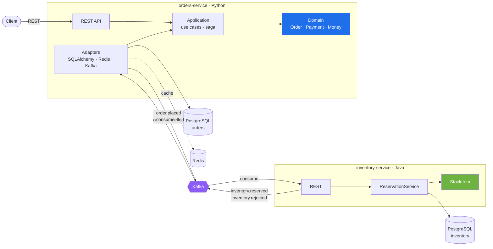
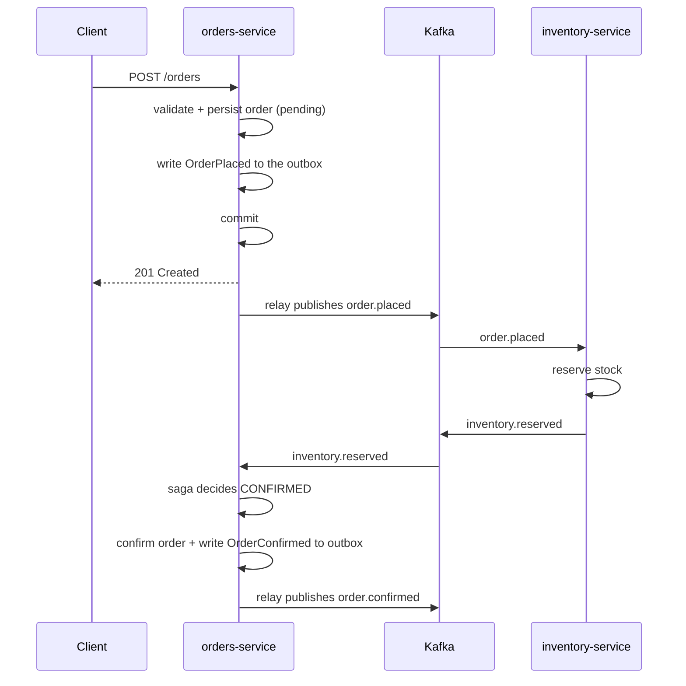

# Commerce Platform

Order management for an online store. Handles the order lifecycle from
checkout to shipment, coordinates stock reservation with the inventory
service, and guarantees that state changes and published events stay
consistent.

Two services, two databases, one contract between them: the events published
to Kafka.

[](https://github.com/jorgecbr/commerce-platform/actions/workflows/ci.yml)
[](https://www.python.org/)
[](https://fastapi.tiangolo.com/)
[](https://openjdk.org/)
[](https://spring.io/projects/spring-boot)
[](https://www.postgresql.org/)
[](https://kafka.apache.org/)
[](LICENSE)

## Services

| Service | Stack | Responsibility |
|---|---|---|
| `orders-service` | Python 3.12 · FastAPI | Order lifecycle, pricing, payments, saga orchestration |
| `inventory-service` | Java 21 · Spring Boot | Stock levels, reservations |

Each service owns its own database and never reads the other's tables. The
only contract between them is the events published to Kafka.

## Architecture



### Inside `orders-service`

```
app/
├── domain/         entities, value objects, invariants. Imports nothing.
├── application/    use cases, ports, saga decisions
└── adapters/       http, db, cache, events
```

`domain/` imports nothing from the rest of the codebase — no ORM, no web
framework, no broker client. The business rules are therefore testable in
isolation and portable to another runtime without rewriting them.

## How an order flows



When stock is unavailable the inventory service emits `inventory.rejected`
and the saga cancels the order instead, which in turn releases any reservation
already made. `orders-service` owns the decision, so the flow stays readable
in one place rather than spread across every event handler.

## The two problems this design solves

### Publishing an event without losing it

Writing to the database and writing to the broker are two separate systems.
Publishing first and committing second allows an event for an order that was
never stored. Committing first and publishing second can drop the event if the
process dies in between.

Both the order and its `OrderPlaced` event are written in **one
transaction**. A relay then moves outbox rows to Kafka and marks them
published. If the relay dies mid-batch, the row is still unpublished and the
event is sent again.

### Receiving the same event twice

The relay is at-least-once on purpose, so consumers must be idempotent. Each
consumer inserts the message id into an inbox table **before** doing the work;
a duplicate insert fails, and the message is skipped. Inserting after the work
would leave a window where a crash causes the effect to happen twice.

## Data model notes

**Money is stored in minor units.** Amounts are integers, never floats, and the
currency travels with the amount so `Money(1000, "USD") + Money(500, "EUR")`
raises instead of producing a wrong total. Zero-decimal currencies (JPY) and
three-decimal ones (KWD) are handled.

**The order lifecycle is a transition table.** `ALLOWED_TRANSITIONS` maps each
status to the statuses reachable from it, so an illegal transition is not a
branch you can forget to update.

**Optimistic concurrency on both sides.** The `orders` table carries a
`version`; the UPDATE includes the loaded version and a zero row count means
another transaction won. `stock_items` does the same, which is what stops two
orders for the last unit from both succeeding.

## Development

```shell
make up          # the whole stack: infra, both services, the worker
make migrate     # apply migrations
make run         # orders-service on :8000
make run-java    # inventory-service on :8080
make check       # lint, types, dependencies, tests
make verify      # end-to-end check of the saga (needs the stack running)
```

Place an order and watch the saga complete:

```shell
curl -X POST localhost:8000/orders -H 'content-type: application/json' -d '{
  "customer_id": "customer-42",
  "lines": [{"sku": "SKU-001", "quantity": 2, "unit_price": "10.00", "currency": "USD"}]
}'

docker compose logs -f inventory-service   # "Reserved stock for order ..."
docker compose logs -f orders-worker       # "Order ... moved to confirmed"
```

## Testing

```shell
make test              # everything
make test-unit         # no infrastructure required
make test-integration  # needs PostgreSQL, Redis and Kafka
make verify            # the saga, end to end, against the running stack
cd inventory-service && mvn test
```

Unit tests cover the domain and the use cases with in-memory fakes, so the
Python suite runs in about a second without any container. Integration tests
run against real PostgreSQL and a real Kafka broker and cover the guarantees
unit tests cannot: that the SQL is valid, that a lost update is rejected, that
the order and its event share a transaction, and that a message delivered
twice is handled once.

| Suite | What it runs |
|---|---|
| `orders-service` | pytest, 136 tests |
| `inventory-service` | JUnit 5, 15 tests |

Integration tests skip themselves when the infrastructure is not reachable,
so a developer without Docker still gets a green local run.

## How this is proven

Unit tests are necessary and not sufficient, and this repository is a concrete
example of why.

Every unit test in the project passed while the system did not work.
`order.placed` was published without its lines, so the inventory service parsed
a missing field as an empty list, reserved **zero units**, and answered
`inventory.reserved` anyway. The saga then confirmed the order. The result was
orders confirmed with no stock behind them, while the catalogue still showed
every unit available.

Nothing in a single-layer test can catch that. The domain was correct, the
mapper serialised exactly what the event contained, the outbox stored it
faithfully, and the Java tests used a stub payload that did include lines. The
defect existed only in the gap between two services.

So the suite ends with a check that crosses that gap:

```shell
make verify
```

```text
0. Stack must be running
  PASS postgres / redis / kafka / orders-service / orders-worker / inventory-service

1. Happy path: order -> stock reserved -> order confirmed
  stock before: 100
  PASS order created and pending
  PASS saga confirmed the order
  PASS inventory service reserved 3 units (100 -> 97)
  PASS outbox published both events
  PASS saga consumer registered the message in its inbox

2. Compensation: no stock -> order cancelled -> nothing reserved
  PASS saga cancelled the order instead of confirming it
  PASS no stock was wrongly reserved
  PASS order.cancelled published for the compensating action
```

The second journey is the one that justifies the whole design. A system that
can confirm an order but cannot undo it is worse than one that does neither,
because it looks correct. `make verify` runs on every push.

### Continuous integration

Five jobs, ordered so a lint error costs seconds instead of minutes:

| Job | Checks |
|---|---|
| `quality gates` | ruff, mypy `--strict`, deptry — blocks everything else |
| `unit and integration tests` | 136 tests against real PostgreSQL, Kafka and Redis; coverage enforced at 85% |
| `inventory-service (java)` | JUnit 5 against the Spring service |
| `saga end-to-end` | builds both images, migrates, runs `verify_saga.sh` |
| `repository hygiene` | no committed secrets, migrations present, every built service has a Dockerfile |

When the saga job fails it dumps both the `orders` and the `stock_items`
tables, because "the saga did not finish" is useless without knowing how far
it got.

## Documentation

- [`docs/architecture/c4-context.md`](docs/architecture/c4-context.md) — system context and ubiquitous language
- [`orders-service/README.md`](orders-service/README.md) — Python internals
- [`inventory-service/README.md`](inventory-service/README.md) — Java internals
- [`scripts/verify_saga.sh`](scripts/verify_saga.sh) — the end-to-end check, readable top to bottom

## Not included

Deliberately out of scope, so that what is here can be explained properly:

| | Why |
|---|---|
| gRPC | REST plus Kafka cover the two interaction styles the platform actually needs |
| A CQRS read model | The write side is the interesting half; a denormalised read model would be one more table with little to say |
| Kubernetes | Compose already runs the stack; manifests would add volume without adding understanding |

## License

MIT — see [LICENSE](LICENSE).