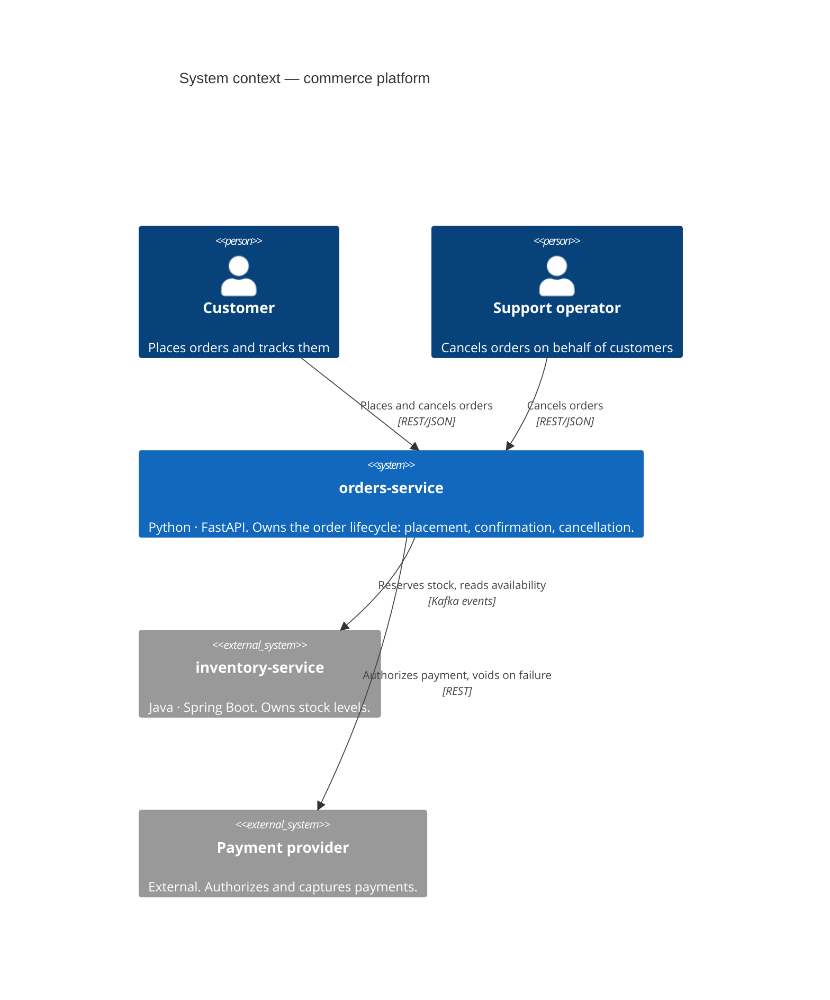

# System context (C4 level 1)

The whole platform in one picture: who uses it, and what it talks to.

## Bounded contexts

Two contexts inside `orders-service`, kept separate on purpose:

| Context | Owns | Does **not** own |
|---|---|---|
| **ordering** | `Order`, its lifecycle and its events | stock levels, card data |
| **payments** | `Payment` and its authorize/void lifecycle | the order itself |

They live in the same deployable because they change together and share a
transaction. Splitting them into two services is an option recorded in the
roadmap, not a decision taken up front: premature decomposition is harder to
undo than premature merging.

## Ubiquitous language

The words below are the ones used in the code, the tests and the events. If a
word is not in this table, it does not belong in the model.

| Term | Meaning |
|---|---|
| **Order** | What the customer asked for. A basket plus a lifecycle. |
| **Order line** | One SKU with an agreed quantity and unit price. |
| **Total** | Sum of line totals. The price is frozen when the order is placed. |
| **Placed** | The order exists and is waiting for stock. |
| **Confirmed** | Stock was reserved. The order can no longer be edited. |
| **Shipped** | The parcel left the warehouse. Terminal. |
| **Cancelled** | The order will not happen. Terminal. |
| **Reserve** | Take stock out of availability without selling it yet. |
| **Release** | Give reserved stock back. The compensating action of *reserve*. |
| **Compensating action** | A business action that undoes a previous one, because there are no distributed transactions. |